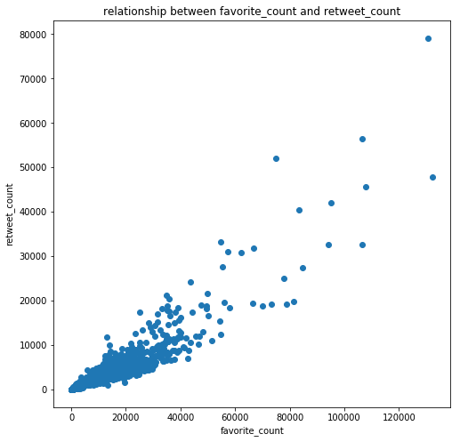
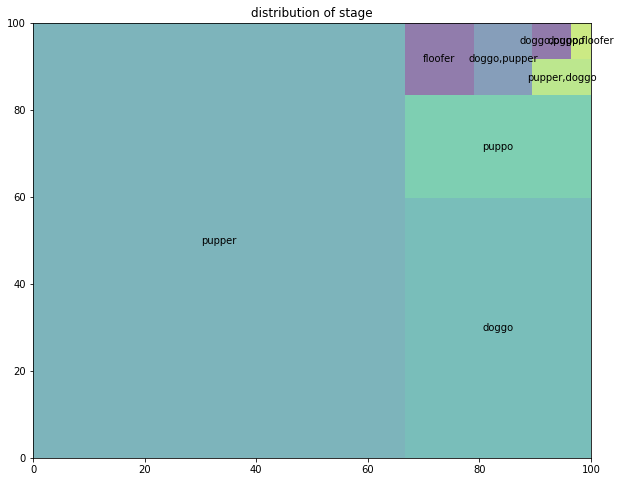
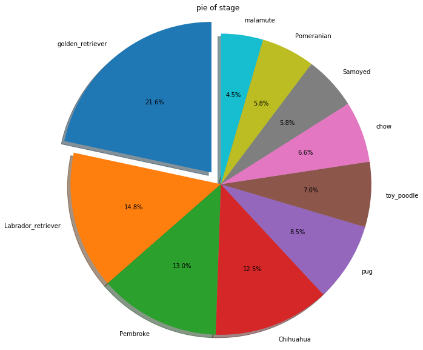

# 收集数据
- WeRateDogs 的推特档案数据获取
- 推特图像的预测数据


```python

```


```python
import requests
import pandas as pd
pd.options.display.max_columns=200
pd.set_option('max_colwidth',100)
```
WeRateDogs 的推特档案数据获取

```python
twitter_archive_enhanced=pd.read_csv("twitter-archive-enhanced.csv")
```


```python
twitter_archive_enhanced.head(5)
```


<div>
<style scoped>
    .dataframe tbody tr th:only-of-type {
        vertical-align: middle;
    }

    .dataframe tbody tr th {
        vertical-align: top;
    }

    .dataframe thead th {
        text-align: right;
    }
</style>
<table border="1" class="dataframe">
  <thead>
    <tr style="text-align: right;">
      <th></th>
      <th>tweet_id</th>
      <th>in_reply_to_status_id</th>
      <th>in_reply_to_user_id</th>
      <th>timestamp</th>
      <th>source</th>
      <th>text</th>
      <th>retweeted_status_id</th>
      <th>retweeted_status_user_id</th>
      <th>retweeted_status_timestamp</th>
      <th>expanded_urls</th>
      <th>rating_numerator</th>
      <th>rating_denominator</th>
      <th>name</th>
      <th>doggo</th>
      <th>floofer</th>
      <th>pupper</th>
      <th>puppo</th>
    </tr>
  </thead>
  <tbody>
    <tr>
      <th>0</th>
      <td>892420643555336193</td>
      <td>NaN</td>
      <td>NaN</td>
      <td>2017-08-01 16:23:56 +0000</td>
      <td>&lt;a href="http://twitter.com/download/iphone" rel="nofollow"&gt;Twitter for iPhone&lt;/a&gt;</td>
      <td>This is Phineas. He's a mystical boy. Only ever appears in the hole of a donut. 13/10 https://t....</td>
      <td>NaN</td>
      <td>NaN</td>
      <td>NaN</td>
      <td>https://twitter.com/dog_rates/status/892420643555336193/photo/1</td>
      <td>13</td>
      <td>10</td>
      <td>Phineas</td>
      <td>None</td>
      <td>None</td>
      <td>None</td>
      <td>None</td>
    </tr>
    <tr>
      <th>1</th>
      <td>892177421306343426</td>
      <td>NaN</td>
      <td>NaN</td>
      <td>2017-08-01 00:17:27 +0000</td>
      <td>&lt;a href="http://twitter.com/download/iphone" rel="nofollow"&gt;Twitter for iPhone&lt;/a&gt;</td>
      <td>This is Tilly. She's just checking pup on you. Hopes you're doing ok. If not, she's available fo...</td>
      <td>NaN</td>
      <td>NaN</td>
      <td>NaN</td>
      <td>https://twitter.com/dog_rates/status/892177421306343426/photo/1</td>
      <td>13</td>
      <td>10</td>
      <td>Tilly</td>
      <td>None</td>
      <td>None</td>
      <td>None</td>
      <td>None</td>
    </tr>
    <tr>
      <th>2</th>
      <td>891815181378084864</td>
      <td>NaN</td>
      <td>NaN</td>
      <td>2017-07-31 00:18:03 +0000</td>
      <td>&lt;a href="http://twitter.com/download/iphone" rel="nofollow"&gt;Twitter for iPhone&lt;/a&gt;</td>
      <td>This is Archie. He is a rare Norwegian Pouncing Corgo. Lives in the tall grass. You never know w...</td>
      <td>NaN</td>
      <td>NaN</td>
      <td>NaN</td>
      <td>https://twitter.com/dog_rates/status/891815181378084864/photo/1</td>
      <td>12</td>
      <td>10</td>
      <td>Archie</td>
      <td>None</td>
      <td>None</td>
      <td>None</td>
      <td>None</td>
    </tr>
    <tr>
      <th>3</th>
      <td>891689557279858688</td>
      <td>NaN</td>
      <td>NaN</td>
      <td>2017-07-30 15:58:51 +0000</td>
      <td>&lt;a href="http://twitter.com/download/iphone" rel="nofollow"&gt;Twitter for iPhone&lt;/a&gt;</td>
      <td>This is Darla. She commenced a snooze mid meal. 13/10 happens to the best of us https://t.co/tD3...</td>
      <td>NaN</td>
      <td>NaN</td>
      <td>NaN</td>
      <td>https://twitter.com/dog_rates/status/891689557279858688/photo/1</td>
      <td>13</td>
      <td>10</td>
      <td>Darla</td>
      <td>None</td>
      <td>None</td>
      <td>None</td>
      <td>None</td>
    </tr>
    <tr>
      <th>4</th>
      <td>891327558926688256</td>
      <td>NaN</td>
      <td>NaN</td>
      <td>2017-07-29 16:00:24 +0000</td>
      <td>&lt;a href="http://twitter.com/download/iphone" rel="nofollow"&gt;Twitter for iPhone&lt;/a&gt;</td>
      <td>This is Franklin. He would like you to stop calling him "cute." He is a very fierce shark and sh...</td>
      <td>NaN</td>
      <td>NaN</td>
      <td>NaN</td>
      <td>https://twitter.com/dog_rates/status/891327558926688256/photo/1,https://twitter.com/dog_rates/st...</td>
      <td>12</td>
      <td>10</td>
      <td>Franklin</td>
      <td>None</td>
      <td>None</td>
      <td>None</td>
      <td>None</td>
    </tr>
  </tbody>
</table>
</div>


获取推特图像的预测数据

```python
import requests 
with open("image-predictions.tsv",mode='wb') as f:
    file = requests.get('https://raw.githubusercontent.com/udacity/new-dand-advanced-china/master/%E6%95%B0%E6%8D%AE%E6%B8%85%E6%B4%97/WeRateDogs%E9%A1%B9%E7%9B%AE/image-predictions.tsv')
    f.write(file.content)
    
```


```python
from io import BytesIO
with open("image-predictions.tsv",mode='wb') as f:
    f.write(file.content)
```


```python
image_predictions=pd.read_csv("image-predictions.tsv",sep="\t")  
```


```python
image_predictions.head(5)
```


<div>
<style scoped>
    .dataframe tbody tr th:only-of-type {
        vertical-align: middle;
    }

    .dataframe tbody tr th {
        vertical-align: top;
    }

    .dataframe thead th {
        text-align: right;
    }
</style>
<table border="1" class="dataframe">
  <thead>
    <tr style="text-align: right;">
      <th></th>
      <th>tweet_id</th>
      <th>jpg_url</th>
      <th>img_num</th>
      <th>p1</th>
      <th>p1_conf</th>
      <th>p1_dog</th>
      <th>p2</th>
      <th>p2_conf</th>
      <th>p2_dog</th>
      <th>p3</th>
      <th>p3_conf</th>
      <th>p3_dog</th>
    </tr>
  </thead>
  <tbody>
    <tr>
      <th>0</th>
      <td>666020888022790149</td>
      <td>https://pbs.twimg.com/media/CT4udn0WwAA0aMy.jpg</td>
      <td>1</td>
      <td>Welsh_springer_spaniel</td>
      <td>0.465074</td>
      <td>True</td>
      <td>collie</td>
      <td>0.156665</td>
      <td>True</td>
      <td>Shetland_sheepdog</td>
      <td>0.061428</td>
      <td>True</td>
    </tr>
    <tr>
      <th>1</th>
      <td>666029285002620928</td>
      <td>https://pbs.twimg.com/media/CT42GRgUYAA5iDo.jpg</td>
      <td>1</td>
      <td>redbone</td>
      <td>0.506826</td>
      <td>True</td>
      <td>miniature_pinscher</td>
      <td>0.074192</td>
      <td>True</td>
      <td>Rhodesian_ridgeback</td>
      <td>0.072010</td>
      <td>True</td>
    </tr>
    <tr>
      <th>2</th>
      <td>666033412701032449</td>
      <td>https://pbs.twimg.com/media/CT4521TWwAEvMyu.jpg</td>
      <td>1</td>
      <td>German_shepherd</td>
      <td>0.596461</td>
      <td>True</td>
      <td>malinois</td>
      <td>0.138584</td>
      <td>True</td>
      <td>bloodhound</td>
      <td>0.116197</td>
      <td>True</td>
    </tr>
    <tr>
      <th>3</th>
      <td>666044226329800704</td>
      <td>https://pbs.twimg.com/media/CT5Dr8HUEAA-lEu.jpg</td>
      <td>1</td>
      <td>Rhodesian_ridgeback</td>
      <td>0.408143</td>
      <td>True</td>
      <td>redbone</td>
      <td>0.360687</td>
      <td>True</td>
      <td>miniature_pinscher</td>
      <td>0.222752</td>
      <td>True</td>
    </tr>
    <tr>
      <th>4</th>
      <td>666049248165822465</td>
      <td>https://pbs.twimg.com/media/CT5IQmsXIAAKY4A.jpg</td>
      <td>1</td>
      <td>miniature_pinscher</td>
      <td>0.560311</td>
      <td>True</td>
      <td>Rottweiler</td>
      <td>0.243682</td>
      <td>True</td>
      <td>Doberman</td>
      <td>0.154629</td>
      <td>True</td>
    </tr>
  </tbody>
</table>
</div>


每条推特的额附加数据

```python
import json
with open("tweet_json.txt") as f:
        data={"id":[],"retweet_count":[],"favorite_count":[]}
        for line in f.readlines():
                json_obj=json.loads(line)
                data['id'].append(json_obj['id'])
                data['retweet_count'].append(json_obj['retweet_count'])
                data['favorite_count'].append(json_obj['favorite_count'])
        tweet_json=pd.DataFrame(data)
```


```python
tweet_json.head(5)
```


<div>
<style scoped>
    .dataframe tbody tr th:only-of-type {
        vertical-align: middle;
    }

    .dataframe tbody tr th {
        vertical-align: top;
    }

    .dataframe thead th {
        text-align: right;
    }
</style>
<table border="1" class="dataframe">
  <thead>
    <tr style="text-align: right;">
      <th></th>
      <th>id</th>
      <th>retweet_count</th>
      <th>favorite_count</th>
    </tr>
  </thead>
  <tbody>
    <tr>
      <th>0</th>
      <td>892420643555336193</td>
      <td>8842</td>
      <td>39492</td>
    </tr>
    <tr>
      <th>1</th>
      <td>892177421306343426</td>
      <td>6480</td>
      <td>33786</td>
    </tr>
    <tr>
      <th>2</th>
      <td>891815181378084864</td>
      <td>4301</td>
      <td>25445</td>
    </tr>
    <tr>
      <th>3</th>
      <td>891689557279858688</td>
      <td>8925</td>
      <td>42863</td>
    </tr>
    <tr>
      <th>4</th>
      <td>891327558926688256</td>
      <td>9721</td>
      <td>41016</td>
    </tr>
  </tbody>
</table>
</div>


```python

```

# 对项目数据进行评估

## twitter_archive_enhanced


```python
twitter_archive_enhanced.head(5)
```


<div>
<style scoped>
    .dataframe tbody tr th:only-of-type {
        vertical-align: middle;
    }

    .dataframe tbody tr th {
        vertical-align: top;
    }

    .dataframe thead th {
        text-align: right;
    }
</style>
<table border="1" class="dataframe">
  <thead>
    <tr style="text-align: right;">
      <th></th>
      <th>tweet_id</th>
      <th>in_reply_to_status_id</th>
      <th>in_reply_to_user_id</th>
      <th>timestamp</th>
      <th>source</th>
      <th>text</th>
      <th>retweeted_status_id</th>
      <th>retweeted_status_user_id</th>
      <th>retweeted_status_timestamp</th>
      <th>expanded_urls</th>
      <th>rating_numerator</th>
      <th>rating_denominator</th>
      <th>name</th>
      <th>doggo</th>
      <th>floofer</th>
      <th>pupper</th>
      <th>puppo</th>
    </tr>
  </thead>
  <tbody>
    <tr>
      <th>0</th>
      <td>892420643555336193</td>
      <td>NaN</td>
      <td>NaN</td>
      <td>2017-08-01 16:23:56 +0000</td>
      <td>&lt;a href="http://twitter.com/download/iphone" rel="nofollow"&gt;Twitter for iPhone&lt;/a&gt;</td>
      <td>This is Phineas. He's a mystical boy. Only ever appears in the hole of a donut. 13/10 https://t....</td>
      <td>NaN</td>
      <td>NaN</td>
      <td>NaN</td>
      <td>https://twitter.com/dog_rates/status/892420643555336193/photo/1</td>
      <td>13</td>
      <td>10</td>
      <td>Phineas</td>
      <td>None</td>
      <td>None</td>
      <td>None</td>
      <td>None</td>
    </tr>
    <tr>
      <th>1</th>
      <td>892177421306343426</td>
      <td>NaN</td>
      <td>NaN</td>
      <td>2017-08-01 00:17:27 +0000</td>
      <td>&lt;a href="http://twitter.com/download/iphone" rel="nofollow"&gt;Twitter for iPhone&lt;/a&gt;</td>
      <td>This is Tilly. She's just checking pup on you. Hopes you're doing ok. If not, she's available fo...</td>
      <td>NaN</td>
      <td>NaN</td>
      <td>NaN</td>
      <td>https://twitter.com/dog_rates/status/892177421306343426/photo/1</td>
      <td>13</td>
      <td>10</td>
      <td>Tilly</td>
      <td>None</td>
      <td>None</td>
      <td>None</td>
      <td>None</td>
    </tr>
    <tr>
      <th>2</th>
      <td>891815181378084864</td>
      <td>NaN</td>
      <td>NaN</td>
      <td>2017-07-31 00:18:03 +0000</td>
      <td>&lt;a href="http://twitter.com/download/iphone" rel="nofollow"&gt;Twitter for iPhone&lt;/a&gt;</td>
      <td>This is Archie. He is a rare Norwegian Pouncing Corgo. Lives in the tall grass. You never know w...</td>
      <td>NaN</td>
      <td>NaN</td>
      <td>NaN</td>
      <td>https://twitter.com/dog_rates/status/891815181378084864/photo/1</td>
      <td>12</td>
      <td>10</td>
      <td>Archie</td>
      <td>None</td>
      <td>None</td>
      <td>None</td>
      <td>None</td>
    </tr>
    <tr>
      <th>3</th>
      <td>891689557279858688</td>
      <td>NaN</td>
      <td>NaN</td>
      <td>2017-07-30 15:58:51 +0000</td>
      <td>&lt;a href="http://twitter.com/download/iphone" rel="nofollow"&gt;Twitter for iPhone&lt;/a&gt;</td>
      <td>This is Darla. She commenced a snooze mid meal. 13/10 happens to the best of us https://t.co/tD3...</td>
      <td>NaN</td>
      <td>NaN</td>
      <td>NaN</td>
      <td>https://twitter.com/dog_rates/status/891689557279858688/photo/1</td>
      <td>13</td>
      <td>10</td>
      <td>Darla</td>
      <td>None</td>
      <td>None</td>
      <td>None</td>
      <td>None</td>
    </tr>
    <tr>
      <th>4</th>
      <td>891327558926688256</td>
      <td>NaN</td>
      <td>NaN</td>
      <td>2017-07-29 16:00:24 +0000</td>
      <td>&lt;a href="http://twitter.com/download/iphone" rel="nofollow"&gt;Twitter for iPhone&lt;/a&gt;</td>
      <td>This is Franklin. He would like you to stop calling him "cute." He is a very fierce shark and sh...</td>
      <td>NaN</td>
      <td>NaN</td>
      <td>NaN</td>
      <td>https://twitter.com/dog_rates/status/891327558926688256/photo/1,https://twitter.com/dog_rates/st...</td>
      <td>12</td>
      <td>10</td>
      <td>Franklin</td>
      <td>None</td>
      <td>None</td>
      <td>None</td>
      <td>None</td>
    </tr>
  </tbody>
</table>
</div>


```python
twitter_archive_enhanced.tail(5)
```


<div>
<style scoped>
    .dataframe tbody tr th:only-of-type {
        vertical-align: middle;
    }

    .dataframe tbody tr th {
        vertical-align: top;
    }

    .dataframe thead th {
        text-align: right;
    }
</style>
<table border="1" class="dataframe">
  <thead>
    <tr style="text-align: right;">
      <th></th>
      <th>tweet_id</th>
      <th>in_reply_to_status_id</th>
      <th>in_reply_to_user_id</th>
      <th>timestamp</th>
      <th>source</th>
      <th>text</th>
      <th>retweeted_status_id</th>
      <th>retweeted_status_user_id</th>
      <th>retweeted_status_timestamp</th>
      <th>expanded_urls</th>
      <th>rating_numerator</th>
      <th>rating_denominator</th>
      <th>name</th>
      <th>doggo</th>
      <th>floofer</th>
      <th>pupper</th>
      <th>puppo</th>
    </tr>
  </thead>
  <tbody>
    <tr>
      <th>2351</th>
      <td>666049248165822465</td>
      <td>NaN</td>
      <td>NaN</td>
      <td>2015-11-16 00:24:50 +0000</td>
      <td>&lt;a href="http://twitter.com/download/iphone" rel="nofollow"&gt;Twitter for iPhone&lt;/a&gt;</td>
      <td>Here we have a 1949 1st generation vulpix. Enjoys sweat tea and Fox News. Cannot be phased. 5/10...</td>
      <td>NaN</td>
      <td>NaN</td>
      <td>NaN</td>
      <td>https://twitter.com/dog_rates/status/666049248165822465/photo/1</td>
      <td>5</td>
      <td>10</td>
      <td>None</td>
      <td>None</td>
      <td>None</td>
      <td>None</td>
      <td>None</td>
    </tr>
    <tr>
      <th>2352</th>
      <td>666044226329800704</td>
      <td>NaN</td>
      <td>NaN</td>
      <td>2015-11-16 00:04:52 +0000</td>
      <td>&lt;a href="http://twitter.com/download/iphone" rel="nofollow"&gt;Twitter for iPhone&lt;/a&gt;</td>
      <td>This is a purebred Piers Morgan. Loves to Netflix and chill. Always looks like he forgot to unpl...</td>
      <td>NaN</td>
      <td>NaN</td>
      <td>NaN</td>
      <td>https://twitter.com/dog_rates/status/666044226329800704/photo/1</td>
      <td>6</td>
      <td>10</td>
      <td>a</td>
      <td>None</td>
      <td>None</td>
      <td>None</td>
      <td>None</td>
    </tr>
    <tr>
      <th>2353</th>
      <td>666033412701032449</td>
      <td>NaN</td>
      <td>NaN</td>
      <td>2015-11-15 23:21:54 +0000</td>
      <td>&lt;a href="http://twitter.com/download/iphone" rel="nofollow"&gt;Twitter for iPhone&lt;/a&gt;</td>
      <td>Here is a very happy pup. Big fan of well-maintained decks. Just look at that tongue. 9/10 would...</td>
      <td>NaN</td>
      <td>NaN</td>
      <td>NaN</td>
      <td>https://twitter.com/dog_rates/status/666033412701032449/photo/1</td>
      <td>9</td>
      <td>10</td>
      <td>a</td>
      <td>None</td>
      <td>None</td>
      <td>None</td>
      <td>None</td>
    </tr>
    <tr>
      <th>2354</th>
      <td>666029285002620928</td>
      <td>NaN</td>
      <td>NaN</td>
      <td>2015-11-15 23:05:30 +0000</td>
      <td>&lt;a href="http://twitter.com/download/iphone" rel="nofollow"&gt;Twitter for iPhone&lt;/a&gt;</td>
      <td>This is a western brown Mitsubishi terrier. Upset about leaf. Actually 2 dogs here. 7/10 would w...</td>
      <td>NaN</td>
      <td>NaN</td>
      <td>NaN</td>
      <td>https://twitter.com/dog_rates/status/666029285002620928/photo/1</td>
      <td>7</td>
      <td>10</td>
      <td>a</td>
      <td>None</td>
      <td>None</td>
      <td>None</td>
      <td>None</td>
    </tr>
    <tr>
      <th>2355</th>
      <td>666020888022790149</td>
      <td>NaN</td>
      <td>NaN</td>
      <td>2015-11-15 22:32:08 +0000</td>
      <td>&lt;a href="http://twitter.com/download/iphone" rel="nofollow"&gt;Twitter for iPhone&lt;/a&gt;</td>
      <td>Here we have a Japanese Irish Setter. Lost eye in Vietnam (?). Big fan of relaxing on stair. 8/1...</td>
      <td>NaN</td>
      <td>NaN</td>
      <td>NaN</td>
      <td>https://twitter.com/dog_rates/status/666020888022790149/photo/1</td>
      <td>8</td>
      <td>10</td>
      <td>None</td>
      <td>None</td>
      <td>None</td>
      <td>None</td>
      <td>None</td>
    </tr>
  </tbody>
</table>
</div>


```python
twitter_archive_enhanced.columns.values.tolist()
```


    ['tweet_id',
     'in_reply_to_status_id',
     'in_reply_to_user_id',
     'timestamp',
     'source',
     'text',
     'retweeted_status_id',
     'retweeted_status_user_id',
     'retweeted_status_timestamp',
     'expanded_urls',
     'rating_numerator',
     'rating_denominator',
     'name',
     'doggo',
     'floofer',
     'pupper',
     'puppo']


```python
twitter_archive_enhanced.source.sample(8)
```


    215     <a href="http://twitter.com/download/iphone" rel="nofollow">Twitter for iPhone</a>
    1460    <a href="http://twitter.com/download/iphone" rel="nofollow">Twitter for iPhone</a>
    1765    <a href="http://twitter.com/download/iphone" rel="nofollow">Twitter for iPhone</a>
    1671    <a href="http://twitter.com/download/iphone" rel="nofollow">Twitter for iPhone</a>
    847     <a href="http://twitter.com/download/iphone" rel="nofollow">Twitter for iPhone</a>
    1521    <a href="http://twitter.com/download/iphone" rel="nofollow">Twitter for iPhone</a>
    461     <a href="http://twitter.com/download/iphone" rel="nofollow">Twitter for iPhone</a>
    631     <a href="http://twitter.com/download/iphone" rel="nofollow">Twitter for iPhone</a>
    Name: source, dtype: object


twitter_archive_enhanced的属性有以下：

tweet_id：推特ID

in_reply_to_status_id：回复ID

in_reply_to_user_id：被回复推文原始用户ID

timestamp：发tweet的时间戳

source：tweet来源（移动端或web端）

text：推文内容

retweeted_status_id：转发ID

retweeted_status_user_id：转发用户ID

retweeted_status_timestamp：转发时间

expanded_urls：推文链接

rating_numerator：评分分子

rating_denominator：评分分母

name：狗狗的名字

doggo：狗的成长阶段

floofer：狗的成长阶段

pupper：狗的成长阶段

puppo: 狗的成长阶段


```python
### 查看整体数据情况
twitter_archive_enhanced.info()
```

    <class 'pandas.core.frame.DataFrame'>
    RangeIndex: 2356 entries, 0 to 2355
    Data columns (total 17 columns):
    tweet_id                      2356 non-null int64
    in_reply_to_status_id         78 non-null float64
    in_reply_to_user_id           78 non-null float64
    timestamp                     2356 non-null object
    source                        2356 non-null object
    text                          2356 non-null object
    retweeted_status_id           181 non-null float64
    retweeted_status_user_id      181 non-null float64
    retweeted_status_timestamp    181 non-null object
    expanded_urls                 2297 non-null object
    rating_numerator              2356 non-null int64
    rating_denominator            2356 non-null int64
    name                          2356 non-null object
    doggo                         2356 non-null object
    floofer                       2356 non-null object
    pupper                        2356 non-null object
    puppo                         2356 non-null object
    dtypes: float64(4), int64(3), object(10)
    memory usage: 313.0+ KB


从info来看，twitter_archive_enhanced总共有2356条

in_reply_to_status_id，in_reply_to_user_id只有78，数据缺失程度太大，建议去除

timestamp的数据类型应该化成标准的时间格式，应进行数据转化

retweeted_status_id，retweeted_status_user_id，retweeted_status_timestamp 只有181，数据缺失程度比较高，去除


```python
twitter_archive_enhanced.tweet_id.value_counts().max()
```


    1


tweet_id 不存在重复的现象，可以当成主键


```python
twitter_archive_enhanced.timestamp.sample(7)
```


    1262    2016-03-16 16:29:35 +0000
    1048    2016-06-16 01:25:36 +0000
    1422    2016-02-12 16:16:41 +0000
    732     2016-09-29 16:03:01 +0000
    1991    2015-12-04 03:43:54 +0000
    1431    2016-02-10 20:23:19 +0000
    1363    2016-02-25 19:04:13 +0000
    Name: timestamp, dtype: object


查看timestamp，标准时间格式，进行数据转化即可。

```python
twitter_archive_enhanced.source.value_counts()
```


    <a href="http://twitter.com/download/iphone" rel="nofollow">Twitter for iPhone</a>     2221
    <a href="http://vine.co" rel="nofollow">Vine - Make a Scene</a>                          91
    <a href="http://twitter.com" rel="nofollow">Twitter Web Client</a>                       33
    <a href="https://about.twitter.com/products/tweetdeck" rel="nofollow">TweetDeck</a>      11
    Name: source, dtype: int64


source保留着html标签,应去除html标签，不然太难看了吧。。

```python
twitter_archive_enhanced.text.sample(7)
```


    1940               The millennials have spoken and we've decided to immediately demote to a 1/10. Thank you
    1761    Exotic pup here. Tail long af. Throat looks swollen. Might breathe fire. Exceptionally unfluffy ...
    2112    Two unbelievably athletic dogs here. Great form. Perfect execution. 10/10 for both https://t.co/...
    1965    This is Gerald. He's a fluffy lil yellow pup. Always looks like his favorite team just lost on a...
    969     This is Stewie. He will roundhouse kick anyone who questions his independence. 11/10 free af htt...
    665     This is Mosby. He appears to be rather h*ckin snuggable af. 12/10 keep it up Mosby https://t.co/...
    54      This is Gary. He couldn't miss this puppertunity for a selfie. Flawless focusing skills. 13/10 w...
    Name: text, dtype: object


```python
twitter_archive_enhanced.text.value_counts().max()
```


    1


```python
# pd.set_option('display.height', 1000)
pd.set_option('display.max_rows', 500)
pd.set_option('display.max_columns', 500)
pd.set_option('display.width', 1000)
pd.option_context('display.max_rows', None, 'display.max_columns', None)
```


    <pandas.core.config.option_context at 0x7fd877746be0>


```python
import random
random.randint(0,10)
twitter_archive_enhanced.shape
```


    (2356, 17)


```python
for i in range(5):
    print(twitter_archive_enhanced.text.loc[random.randint(0,twitter_archive_enhanced.shape[0])])
    print("\n")
```

    Here's a doggo blowing bubbles. It's downright legendary. 13/10 would watch on repeat forever (vid by Kent Duryee) https://t.co/YcXgHfp1EC
    
    
    This is Wesley. He's clearly trespassing. Seems rather h*ckin violent too. Weaponized forehead. 3/10 wouldn't let in https://t.co/pL7wbMRW7M
    
    
    Yea I can't handle the cuteness anymore. Curls for days. 12/10 for all https://t.co/sAI6gCGZYX
    
    
    Say hello to Levi. He's a Madagascan Butterbop. One of the more docile Butterbops I've seen. 12/10 would give all the pets https://t.co/Zcw9Sccctc
    
    
    This is Toby. He asked for chocolate cake for his birthday but was given vanilla instead. 8/10 it'll be ok Toby https://t.co/sYi2G0he4H
    
    

我们可以观察到，推文中有含狗狗的名字，很对狗狗的评价，以及评分，还有狗狗的相关信息的链接。
不存在重复评论

```python
twitter_archive_enhanced.expanded_urls.sample(7)
```


    2170                                        https://twitter.com/dog_rates/status/669351434509529089/photo/1
    333     https://twitter.com/dog_rates/status/832757312314028032/photo/1,https://twitter.com/dog_rates/st...
    186                                                                                                     NaN
    1344                                        https://twitter.com/dog_rates/status/704499785726889984/photo/1
    1279    https://twitter.com/dog_rates/status/708845821941387268/photo/1,https://twitter.com/dog_rates/st...
    72                                                   https://twitter.com/bbcworld/status/878599868507402241
    1186    https://twitter.com/dog_rates/status/718540630683709445/photo/1,https://twitter.com/dog_rates/st...
    Name: expanded_urls, dtype: object


```python
twitter_archive_enhanced.rating_denominator.value_counts()
```


    10     2333
    11        3
    50        3
    80        2
    20        2
    2         1
    16        1
    40        1
    70        1
    15        1
    90        1
    110       1
    120       1
    130       1
    150       1
    170       1
    7         1
    0         1
    Name: rating_denominator, dtype: int64


这是项目有提示的，但评分分母不为10，很令人困惑。

```python

```


```python
rating_denominator=twitter_archive_enhanced.rating_denominator.value_counts()
twitter_archive_enhanced.query("rating_denominator!=10")[["rating_numerator","rating_denominator"]]
```


<div>
<style scoped>
    .dataframe tbody tr th:only-of-type {
        vertical-align: middle;
    }

    .dataframe tbody tr th {
        vertical-align: top;
    }

    .dataframe thead th {
        text-align: right;
    }
</style>
<table border="1" class="dataframe">
  <thead>
    <tr style="text-align: right;">
      <th></th>
      <th>rating_numerator</th>
      <th>rating_denominator</th>
    </tr>
  </thead>
  <tbody>
    <tr>
      <th>313</th>
      <td>960</td>
      <td>0</td>
    </tr>
    <tr>
      <th>342</th>
      <td>11</td>
      <td>15</td>
    </tr>
    <tr>
      <th>433</th>
      <td>84</td>
      <td>70</td>
    </tr>
    <tr>
      <th>516</th>
      <td>24</td>
      <td>7</td>
    </tr>
    <tr>
      <th>784</th>
      <td>9</td>
      <td>11</td>
    </tr>
    <tr>
      <th>902</th>
      <td>165</td>
      <td>150</td>
    </tr>
    <tr>
      <th>1068</th>
      <td>9</td>
      <td>11</td>
    </tr>
    <tr>
      <th>1120</th>
      <td>204</td>
      <td>170</td>
    </tr>
    <tr>
      <th>1165</th>
      <td>4</td>
      <td>20</td>
    </tr>
    <tr>
      <th>1202</th>
      <td>50</td>
      <td>50</td>
    </tr>
    <tr>
      <th>1228</th>
      <td>99</td>
      <td>90</td>
    </tr>
    <tr>
      <th>1254</th>
      <td>80</td>
      <td>80</td>
    </tr>
    <tr>
      <th>1274</th>
      <td>45</td>
      <td>50</td>
    </tr>
    <tr>
      <th>1351</th>
      <td>60</td>
      <td>50</td>
    </tr>
    <tr>
      <th>1433</th>
      <td>44</td>
      <td>40</td>
    </tr>
    <tr>
      <th>1598</th>
      <td>4</td>
      <td>20</td>
    </tr>
    <tr>
      <th>1634</th>
      <td>143</td>
      <td>130</td>
    </tr>
    <tr>
      <th>1635</th>
      <td>121</td>
      <td>110</td>
    </tr>
    <tr>
      <th>1662</th>
      <td>7</td>
      <td>11</td>
    </tr>
    <tr>
      <th>1663</th>
      <td>20</td>
      <td>16</td>
    </tr>
    <tr>
      <th>1779</th>
      <td>144</td>
      <td>120</td>
    </tr>
    <tr>
      <th>1843</th>
      <td>88</td>
      <td>80</td>
    </tr>
    <tr>
      <th>2335</th>
      <td>1</td>
      <td>2</td>
    </tr>
  </tbody>
</table>
</div>


存在分子比分母大的情况，这是咋滴回事呐？好吧，项目背景有说明：如果分子评级超过分母评级，不需要进行清洗，
根据项目背景知识，我们知道狗狗的名字和评分，都是数据提供者从tweet推文中抓取的。但分母不为10就比较困惑了。
我们看看会不会是因为他正则表达式写不好的原因呢？

```python
index=twitter_archive_enhanced.query("rating_denominator!=10")[["rating_numerator","rating_denominator"]].index
for i in index:
    print(twitter_archive_enhanced.text.loc[i])
    print(twitter_archive_enhanced.rating_numerator.loc[i])
    print(twitter_archive_enhanced.rating_denominator.loc[i])
    print("\n")
```

    @jonnysun @Lin_Manuel ok jomny I know you're excited but 960/00 isn't a valid rating, 13/10 is tho
    960
    0
    
    
    @docmisterio account started on 11/15/15
    11
    15
    
    
    The floofs have been released I repeat the floofs have been released. 84/70 https://t.co/NIYC820tmd
    84
    70
    
    
    Meet Sam. She smiles 24/7 &amp; secretly aspires to be a reindeer. 
    Keep Sam smiling by clicking and sharing this link:
    https://t.co/98tB8y7y7t https://t.co/LouL5vdvxx
    24
    7
    
    
    RT @dog_rates: After so many requests, this is Bretagne. She was the last surviving 9/11 search dog, and our second ever 14/10. RIP https:/…
    9
    11
    
    
    Why does this never happen at my front door... 165/150 https://t.co/HmwrdfEfUE
    165
    150
    
    
    After so many requests, this is Bretagne. She was the last surviving 9/11 search dog, and our second ever 14/10. RIP https://t.co/XAVDNDaVgQ
    9
    11
    
    
    Say hello to this unbelievably well behaved squad of doggos. 204/170 would try to pet all at once https://t.co/yGQI3He3xv
    204
    170
    
    
    Happy 4/20 from the squad! 13/10 for all https://t.co/eV1diwds8a
    4
    20
    
    
    This is Bluebert. He just saw that both #FinalFur match ups are split 50/50. Amazed af. 11/10 https://t.co/Kky1DPG4iq
    50
    50
    
    
    Happy Saturday here's 9 puppers on a bench. 99/90 good work everybody https://t.co/mpvaVxKmc1
    99
    90
    
    
    Here's a brigade of puppers. All look very prepared for whatever happens next. 80/80 https://t.co/0eb7R1Om12
    80
    80
    
    
    From left to right:
    Cletus, Jerome, Alejandro, Burp, &amp; Titson
    None know where camera is. 45/50 would hug all at once https://t.co/sedre1ivTK
    45
    50
    
    
    Here is a whole flock of puppers.  60/50 I'll take the lot https://t.co/9dpcw6MdWa
    60
    50
    
    
    Happy Wednesday here's a bucket of pups. 44/40 would pet all at once https://t.co/HppvrYuamZ
    44
    40
    
    
    Yes I do realize a rating of 4/20 would've been fitting. However, it would be unjust to give these cooperative pups that low of a rating
    4
    20
    
    
    Two sneaky puppers were not initially seen, moving the rating to 143/130. Please forgive us. Thank you https://t.co/kRK51Y5ac3
    143
    130
    
    
    Someone help the girl is being mugged. Several are distracting her while two steal her shoes. Clever puppers 121/110 https://t.co/1zfnTJLt55
    121
    110
    
    
    This is Darrel. He just robbed a 7/11 and is in a high speed police chase. Was just spotted by the helicopter 10/10 https://t.co/7EsP8LmSp5
    7
    11
    
    
    I'm aware that I could've said 20/16, but here at WeRateDogs we are very professional. An inconsistent rating scale is simply irresponsible
    20
    16
    
    
    IT'S PUPPERGEDDON. Total of 144/120 ...I think https://t.co/ZanVtAtvIq
    144
    120
    
    
    Here we have an entire platoon of puppers. Total score: 88/80 would pet all at once https://t.co/y93p6FLvVw
    88
    80
    
    
    This is an Albanian 3 1/2 legged  Episcopalian. Loves well-polished hardwood flooring. Penis on the collar. 9/10 https://t.co/d9NcXFKwLv
    1
    2
    
    

确实是信息提取的问题。

```python
twitter_archive_enhanced.rating_numerator.value_counts()
```


    12      558
    11      464
    10      461
    13      351
    9       158
    8       102
    7        55
    14       54
    5        37
    6        32
    3        19
    4        17
    1         9
    2         9
    420       2
    0         2
    15        2
    75        2
    80        1
    20        1
    24        1
    26        1
    44        1
    50        1
    60        1
    165       1
    84        1
    88        1
    144       1
    182       1
    143       1
    666       1
    960       1
    1776      1
    17        1
    27        1
    45        1
    99        1
    121       1
    204       1
    Name: rating_numerator, dtype: int64


```python
twitter_archive_enhanced[["rating_numerator","rating_denominator"]].sample(10)
```


<div>
<style scoped>
    .dataframe tbody tr th:only-of-type {
        vertical-align: middle;
    }

    .dataframe tbody tr th {
        vertical-align: top;
    }

    .dataframe thead th {
        text-align: right;
    }
</style>
<table border="1" class="dataframe">
  <thead>
    <tr style="text-align: right;">
      <th></th>
      <th>rating_numerator</th>
      <th>rating_denominator</th>
    </tr>
  </thead>
  <tbody>
    <tr>
      <th>1849</th>
      <td>11</td>
      <td>10</td>
    </tr>
    <tr>
      <th>1115</th>
      <td>11</td>
      <td>10</td>
    </tr>
    <tr>
      <th>2010</th>
      <td>10</td>
      <td>10</td>
    </tr>
    <tr>
      <th>1225</th>
      <td>10</td>
      <td>10</td>
    </tr>
    <tr>
      <th>98</th>
      <td>12</td>
      <td>10</td>
    </tr>
    <tr>
      <th>753</th>
      <td>13</td>
      <td>10</td>
    </tr>
    <tr>
      <th>1015</th>
      <td>11</td>
      <td>10</td>
    </tr>
    <tr>
      <th>278</th>
      <td>12</td>
      <td>10</td>
    </tr>
    <tr>
      <th>1138</th>
      <td>12</td>
      <td>10</td>
    </tr>
    <tr>
      <th>1152</th>
      <td>11</td>
      <td>10</td>
    </tr>
  </tbody>
</table>
</div>


```python
twitter_archive_enhanced.query("rating_denominator != 10").rating_denominator.count()/twitter_archive_enhanced.rating_denominator.count() * 100
```


    0.97623089983022071


```python
twitter_archive_enhanced.query("rating_numerator > rating_denominator").rating_denominator.count()/twitter_archive_enhanced.rating_denominator.count() * 100
```


    61.587436332767396


通过观察rating_numerator，rating_denominator，我们发现
1. 存在rating_denominator 不为10的情况，占总比例0.98%，对该类型数据去除
2. 存在rating_numerator > rating_denominator 情况,占总比例的61.59%，
按猜想，应该是喜爱狗狗的人在对狗狗进行评分时没有看到评分级别，打的分数超过了最高分。

```python
twitter_archive_enhanced.name.value_counts()
```


    None            745
    a                55
    Charlie          12
    Cooper           11
    Lucy             11
    Oliver           11
    Lola             10
    Penny            10
    Tucker           10
    Bo                9
    Winston           9
    the               8
    Sadie             8
    Daisy             7
    Buddy             7
    an                7
    Toby              7
    Bailey            7
    Rusty             6
    Dave              6
    Bella             6
    Jack              6
    Scout             6
    Milo              6
    Koda              6
    Leo               6
    Jax               6
    Oscar             6
    Stanley           6
    Louis             5
    Bentley           5
    Gus               5
    Alfie             5
    Larry             5
    Oakley            5
    Phil              5
    Sammy             5
    Finn              5
    George            5
    very              5
    Chester           5
    Sunny             5
    Maddie            4
    Loki              4
    Jerry             4
    just              4
    Riley             4
    Clarence          4
    Clark             4
    Duke              4
    Shadow            4
    Archie            4
    Sophie            4
    Jeffrey           4
    Chip              4
    Scooter           4
    Reggie            4
    Maggie            4
    Luna              4
    Cassie            4
    Winnie            4
    Boomer            4
    Hank              4
    Carl              4
    Brody             4
    Derek             4
    Beau              4
    quite             4
    Moose             4
    Gerald            4
    Walter            4
    Dexter            4
    Bruce             4
    Ruby              4
    Maximus           4
    Gary              4
    Bear              4
    one               4
    Sampson           4
    Reginald          4
    Sebastian         3
    Lorenzo           3
    Paisley           3
    Jimothy           3
    Nala              3
    Zoey              3
    Wallace           3
    Mia               3
    Max               3
    Lily              3
    Ellie             3
    Vincent           3
    Waffles           3
    Wilson            3
    Arnie             3
    Otis              3
    Steven            3
    Ted               3
    Calvin            3
    Coco              3
    Peaches           3
    Rosie             3
    Colby             3
    Reese             3
    Frankie           3
    Gizmo             3
    Louie             3
    Samson            3
    Wyatt             3
    Earl              3
    Olive             3
    Klevin            3
    Rory              3
    Kyle              3
    Zeke              3
    Malcolm           3
    Doug              3
    Terry             2
    Logan             2
    Moreton           2
    Pippa             2
    Ken               2
    Sandy             2
    Pipsy             2
    Hunter            2
    Kevin             2
    Atlas             2
    Juno              2
    Gromit            2
    Penelope          2
    Cash              2
    Timison           2
    Davey             2
    Harper            2
    Romeo             2
    Carly             2
    Piper             2
    getting           2
    Jamesy            2
    Solomon           2
    Django            2
    Herschel          2
    Cupcake           2
    Sierra            2
    Ava               2
    Bob               2
    Chelsea           2
    Kenny             2
    Ollie             2
    Hobbes            2
    Quinn             2
    Benedict          2
    Jeph              2
    CeCe              2
    Abby              2
    Leela             2
    Jesse             2
    Phred             2
    Seamus            2
    Sarge             2
    Kreg              2
    Misty             2
    Churlie           2
    Charles           2
    Franklin          2
    Watson            2
    Nelly             2
    Betty             2
    Flávio            2
    mad               2
    Terrance          2
    Frank             2
    Lenny             2
    Keith             2
    Rocky             2
    Benji             2
    Fizz              2
    Aspen             2
    Dash              2
    Lennon            2
    Belle             2
    Trooper           2
    not               2
    Raymond           2
    Alice             2
    Bungalo           2
    Maxaroni          2
    Griffin           2
    Emmy              2
    Gidget            2
    Levi              2
    Coops             2
    Eve               2
    Hammond           2
    Bernie            2
    Dakota            2
    Mister            2
    Sansa             2
    Olivia            2
    Chipson           2
    Mattie            2
    Nollie            2
    Gabe              2
    actually          2
    Fiona             2
    Lincoln           2
    Luca              2
    Roosevelt         2
    Pickles           2
    Baxter            2
    Hurley            2
    Patrick           2
    Hercules          2
    Odie              2
    Kreggory          2
    Jackson           2
    Oliviér           2
    Crystal           2
    Keurig            2
    Axel              2
    Ozzy              2
    Lou               2
    Moe               2
    Remington         2
    Rubio             2
    Opal              2
    Stephan           2
    Wally             2
    Stubert           2
    Jimison           2
    Rizzy             2
    Theodore          2
    Bisquick          2
    Tyr               2
    Rufus             2
    Shaggy            2
    Pablo             2
    Percy             2
    Cali              2
    Ash               2
    Anakin            2
    Smokey            2
    Albert            2
    Linda             2
    Sugar             2
    Balto             2
    Meyer             2
    Philbert          2
    Kenneth           2
    Bell              2
                   ... 
    Milky             1
    Naphaniel         1
    Bode              1
    Shawwn            1
    Monty             1
    Hazel             1
    Pluto             1
    Swagger           1
    Tess              1
    Raphael           1
    Bloop             1
    Jazz              1
    Remy              1
    Kawhi             1
    Timber            1
    Kevon             1
    Obie              1
    Barclay           1
    Shooter           1
    Pinot             1
    Mojo              1
    Roscoe            1
    Flurpson          1
    Trip              1
    Tuck              1
    Sora              1
    Nida              1
    Zoe               1
    Rambo             1
    Dewey             1
    Furzey            1
    Schnitzel         1
    Geoff             1
    Bertson           1
    Mason             1
    Ike               1
    Alf               1
    Kane              1
    Tupawc            1
    Tug               1
    Bobb              1
    Maks              1
    Emma              1
    Kara              1
    Ito               1
    Banjo             1
    Edd               1
    Bluebert          1
    Buckley           1
    Billl             1
    Jimbo             1
    Tobi              1
    Skittle           1
    Crouton           1
    Jay               1
    Rumble            1
    Gustaf            1
    Crawford          1
    Sojourner         1
    Jeffri            1
    Tove              1
    Fynn              1
    Staniel           1
    Rinna             1
    Arya              1
    Cheryl            1
    Nugget            1
    Meera             1
    Laika             1
    Leonidas          1
    Lambeau           1
    Holly             1
    Wiggles           1
    Mitch             1
    Callie            1
    Murphy            1
    Kaia              1
    Eriq              1
    Stewie            1
    Brat              1
    life              1
    Millie            1
    Dwight            1
    Rorie             1
    Dixie             1
    Darby             1
    Harry             1
    Ronnie            1
    Frönq             1
    Bobby             1
    Kloey             1
    Jackie            1
    Dotsy             1
    Alexander         1
    Maya              1
    Travis            1
    Beebop            1
    Ruffles           1
    Lilli             1
    Sailer            1
    Socks             1
    Mosby             1
    Duchess           1
    Pherb             1
    Goose             1
    Jebberson         1
    Bayley            1
    Bubba             1
    Crimson           1
    Spanky            1
    Pete              1
    Jennifur          1
    Bilbo             1
    Banditt           1
    Ferg              1
    Rose              1
    Poppy             1
    unacceptable      1
    Mo                1
    Biden             1
    Lulu              1
    Kirk              1
    Shakespeare       1
    Marvin            1
    Franq             1
    Skye              1
    Koko              1
    Duddles           1
    Glacier           1
    Beckham           1
    officially        1
    Miley             1
    Coleman           1
    Reptar            1
    Godzilla          1
    Bowie             1
    Ole               1
    Luther            1
    Gin               1
    space             1
    Grizzwald         1
    Blue              1
    Emanuel           1
    Napolean          1
    Kulet             1
    Zara              1
    Striker           1
    O                 1
    Peanut            1
    Kellogg           1
    Arnold            1
    Izzy              1
    Willie            1
    Jim               1
    Hall              1
    Tayzie            1
    Kaiya             1
    Pumpkin           1
    Eugene            1
    Lassie            1
    Jeb               1
    Angel             1
    General           1
    Carper            1
    Petrick           1
    Hector            1
    Derby             1
    Butters           1
    Rodman            1
    Erik              1
    Malikai           1
    Herb              1
    Sobe              1
    Lupe              1
    Blu               1
    Harnold           1
    Hanz              1
    Mack              1
    Venti             1
    Huck              1
    Oreo              1
    Gustav            1
    Gert              1
    Geno              1
    Willow            1
    Eazy              1
    Dobby             1
    Marty             1
    Lillie            1
    Pupcasso          1
    Combo             1
    Stark             1
    Hamrick           1
    Grizzie           1
    Dale              1
    Fwed              1
    Ralpher           1
    Mingus            1
    Gòrdón            1
    Theo              1
    Ginger            1
    Aqua              1
    Jersey            1
    Acro              1
    Kayla             1
    Sage              1
    Beemo             1
    Carll             1
    Dudley            1
    Amélie            1
    Batdog            1
    Ebby              1
    Tilly             1
    Cuddles           1
    Godi              1
    Aldrick           1
    Stephanus         1
    Lorelei           1
    Diogi             1
    Julius            1
    Blakely           1
    Samsom            1
    Rueben            1
    Jangle            1
    Griswold          1
    Halo              1
    Tassy             1
    Zooey             1
    BeBe              1
    Noosh             1
    Tater             1
    Gunner            1
    Benny             1
    Ashleigh          1
    Timmy             1
    Ziva              1
    Al                1
    DayZ              1
    Farfle            1
    Doobert           1
    William           1
    Brandi            1
    Birf              1
    Kobe              1
    Shnuggles         1
    Lucia             1
    Vinnie            1
    Tedrick           1
    Mary              1
    Humphrey          1
    Name: name, Length: 957, dtype: int64


None 出现了好多次，好多狗狗没有名字嘛？
出现了类似“a”,"an"的狗狗名字，那么多狗主人给狗狗叫这么随性的名字吗？
很明显应该不是吧，估计又是信息提取错误。

```python
index=twitter_archive_enhanced.query("name=='an'").index
for i in index:
    print(twitter_archive_enhanced.text.loc[i])
    print(twitter_archive_enhanced.name.loc[i])
    print("\n")
```

    RT @dog_rates: This is an East African Chalupa Seal. We only rate dogs. Please only send in dogs. Thank you... 10/10 https://t.co/iHe6liLwWR
    an
    
    
    This is an Iraqi Speed Kangaroo. It is not a dog. Please only send in dogs. I'm very angry with all of you ...9/10 https://t.co/5qpBTTpgUt
    an
    
    
    This is an East African Chalupa Seal. We only rate dogs. Please only send in dogs. Thank you... 10/10 https://t.co/iHe6liLwWR
    an
    
    
    This is an Irish Rigatoni terrier named Berta. Completely made of rope. No eyes. Quite large. Loves to dance. 10/10 https://t.co/EM5fDykrJg
    an
    
    
    This is an extremely rare horned Parthenon. Not amused. Wears shoes. Overall very nice. 9/10 would pet aggressively https://t.co/QpRjllzWAL
    an
    
    
    This is an Albanian 3 1/2 legged  Episcopalian. Loves well-polished hardwood flooring. Penis on the collar. 9/10 https://t.co/d9NcXFKwLv
    an
    
    
    This is an odd dog. Hard on the outside but loving on the inside. Petting still fun. Doesn't play catch well. 2/10 https://t.co/v5A4vzSDdc
    an
    
    

果然在狗狗名字信息提出上有错误。

```python
twitter_archive_enhanced[["doggo","floofer","pupper","puppo"]].sample(8)
```


<div>
<style scoped>
    .dataframe tbody tr th:only-of-type {
        vertical-align: middle;
    }

    .dataframe tbody tr th {
        vertical-align: top;
    }

    .dataframe thead th {
        text-align: right;
    }
</style>
<table border="1" class="dataframe">
  <thead>
    <tr style="text-align: right;">
      <th></th>
      <th>doggo</th>
      <th>floofer</th>
      <th>pupper</th>
      <th>puppo</th>
    </tr>
  </thead>
  <tbody>
    <tr>
      <th>749</th>
      <td>None</td>
      <td>None</td>
      <td>None</td>
      <td>None</td>
    </tr>
    <tr>
      <th>1164</th>
      <td>None</td>
      <td>None</td>
      <td>None</td>
      <td>None</td>
    </tr>
    <tr>
      <th>1527</th>
      <td>None</td>
      <td>None</td>
      <td>None</td>
      <td>None</td>
    </tr>
    <tr>
      <th>47</th>
      <td>None</td>
      <td>None</td>
      <td>None</td>
      <td>None</td>
    </tr>
    <tr>
      <th>514</th>
      <td>None</td>
      <td>None</td>
      <td>None</td>
      <td>None</td>
    </tr>
    <tr>
      <th>2152</th>
      <td>None</td>
      <td>None</td>
      <td>None</td>
      <td>None</td>
    </tr>
    <tr>
      <th>613</th>
      <td>None</td>
      <td>None</td>
      <td>None</td>
      <td>None</td>
    </tr>
    <tr>
      <th>1963</th>
      <td>None</td>
      <td>None</td>
      <td>None</td>
      <td>None</td>
    </tr>
  </tbody>
</table>
</div>


很明显，"doggo","floofer","pupper","puppo"，属于狗狗的生长状态，他这样子处理是为了把狗狗生长状态独热编码嘛？
这四个属性应该合并成一个属性。

```python
image_predictions.head(5)
```


<div>
<style scoped>
    .dataframe tbody tr th:only-of-type {
        vertical-align: middle;
    }

    .dataframe tbody tr th {
        vertical-align: top;
    }

    .dataframe thead th {
        text-align: right;
    }
</style>
<table border="1" class="dataframe">
  <thead>
    <tr style="text-align: right;">
      <th></th>
      <th>tweet_id</th>
      <th>jpg_url</th>
      <th>img_num</th>
      <th>p1</th>
      <th>p1_conf</th>
      <th>p1_dog</th>
      <th>p2</th>
      <th>p2_conf</th>
      <th>p2_dog</th>
      <th>p3</th>
      <th>p3_conf</th>
      <th>p3_dog</th>
    </tr>
  </thead>
  <tbody>
    <tr>
      <th>0</th>
      <td>666020888022790149</td>
      <td>https://pbs.twimg.com/media/CT4udn0WwAA0aMy.jpg</td>
      <td>1</td>
      <td>Welsh_springer_spaniel</td>
      <td>0.465074</td>
      <td>True</td>
      <td>collie</td>
      <td>0.156665</td>
      <td>True</td>
      <td>Shetland_sheepdog</td>
      <td>0.061428</td>
      <td>True</td>
    </tr>
    <tr>
      <th>1</th>
      <td>666029285002620928</td>
      <td>https://pbs.twimg.com/media/CT42GRgUYAA5iDo.jpg</td>
      <td>1</td>
      <td>redbone</td>
      <td>0.506826</td>
      <td>True</td>
      <td>miniature_pinscher</td>
      <td>0.074192</td>
      <td>True</td>
      <td>Rhodesian_ridgeback</td>
      <td>0.072010</td>
      <td>True</td>
    </tr>
    <tr>
      <th>2</th>
      <td>666033412701032449</td>
      <td>https://pbs.twimg.com/media/CT4521TWwAEvMyu.jpg</td>
      <td>1</td>
      <td>German_shepherd</td>
      <td>0.596461</td>
      <td>True</td>
      <td>malinois</td>
      <td>0.138584</td>
      <td>True</td>
      <td>bloodhound</td>
      <td>0.116197</td>
      <td>True</td>
    </tr>
    <tr>
      <th>3</th>
      <td>666044226329800704</td>
      <td>https://pbs.twimg.com/media/CT5Dr8HUEAA-lEu.jpg</td>
      <td>1</td>
      <td>Rhodesian_ridgeback</td>
      <td>0.408143</td>
      <td>True</td>
      <td>redbone</td>
      <td>0.360687</td>
      <td>True</td>
      <td>miniature_pinscher</td>
      <td>0.222752</td>
      <td>True</td>
    </tr>
    <tr>
      <th>4</th>
      <td>666049248165822465</td>
      <td>https://pbs.twimg.com/media/CT5IQmsXIAAKY4A.jpg</td>
      <td>1</td>
      <td>miniature_pinscher</td>
      <td>0.560311</td>
      <td>True</td>
      <td>Rottweiler</td>
      <td>0.243682</td>
      <td>True</td>
      <td>Doberman</td>
      <td>0.154629</td>
      <td>True</td>
    </tr>
  </tbody>
</table>
</div>


```python
image_predictions.info()
```

    <class 'pandas.core.frame.DataFrame'>
    RangeIndex: 2075 entries, 0 to 2074
    Data columns (total 12 columns):
    tweet_id    2075 non-null int64
    jpg_url     2075 non-null object
    img_num     2075 non-null int64
    p1          2075 non-null object
    p1_conf     2075 non-null float64
    p1_dog      2075 non-null bool
    p2          2075 non-null object
    p2_conf     2075 non-null float64
    p2_dog      2075 non-null bool
    p3          2075 non-null object
    p3_conf     2075 non-null float64
    p3_dog      2075 non-null bool
    dtypes: bool(3), float64(3), int64(2), object(4)
    memory usage: 152.1+ KB


```python
image_predictions.jpg_url.duplicated().value_counts()
```


    False    2009
    True       66
    Name: jpg_url, dtype: int64


狗狗图片链接存在重复。tweet_id 数据类型不对。
#### 质量
##### `twitter_archive_enhanced` 表格
1. tweet_id 应为str类型，而不是int
2. 缺失值过多的列删除，in_reply_to_status_id，in_reply_to_user_id,retweeted_status_id，retweeted_status_user_id，retweeted_status_timestamp
3. 转发的信息的列应该删除  'retweeted_status_id', 'retweeted_status_user_id', 'retweeted_status_timestamp',
3. 数据部分缺失，expanded_urls数据量为2297
3. timestamp的数据类型应该化成标准的时间格式，应进行数据转化
4. 评分分母不全为10，可从text中重新提取
5. source保留着html标签,应去除html标签
6. 狗狗名字存在缺失值,而且名字“a”,"an"应该不为狗狗名字，应该是信息提取错误

##### `image_predictions` 表格
1. image_predictions表中的图片url存在重复，需要删除
3. tweet_id列的数据类型不正确。


#### 清洁度
- doggo、floofer、pupper、puppo 四列可融合成一列；
- 应该将image_predictions与tweet_json这两个表格应该与twitter_archive_enhanced合并，通过tweet id 将3个表格合并为一个表格。


# 清理


```python
# 复制数据集
archive_enhanced_clean = twitter_archive_enhanced.copy()
image_predictions_clean = image_predictions.copy()
tweet_json_clean= tweet_json.copy()
```
定义 ： tweet_id 应为str类型，而不是int代码

```python
archive_enhanced_clean.tweet_id = archive_enhanced_clean.tweet_id.astype(str)
```
测试

```python
type(archive_enhanced_clean.tweet_id[0])
```


    str


定义：
缺失值过多的列删除，
in_reply_to_status_id，in_reply_to_user_id代码

```python
archive_enhanced_clean.drop(['in_reply_to_status_id','in_reply_to_user_id'],axis=1,inplace=True)
```
测试

```python
archive_enhanced_clean.info()
```

    <class 'pandas.core.frame.DataFrame'>
    RangeIndex: 2356 entries, 0 to 2355
    Data columns (total 15 columns):
    tweet_id                      2356 non-null object
    timestamp                     2356 non-null object
    source                        2356 non-null object
    text                          2356 non-null object
    retweeted_status_id           181 non-null float64
    retweeted_status_user_id      181 non-null float64
    retweeted_status_timestamp    181 non-null object
    expanded_urls                 2297 non-null object
    rating_numerator              2356 non-null int64
    rating_denominator            2356 non-null int64
    name                          2356 non-null object
    doggo                         2356 non-null object
    floofer                       2356 non-null object
    pupper                        2356 non-null object
    puppo                         2356 non-null object
    dtypes: float64(2), int64(2), object(11)
    memory usage: 276.2+ KB

定义： 转发的信息的列应该删除  'retweeted_status_id', 'retweeted_status_user_id', 'retweeted_status_timestamp',代码

```python
archive_enhanced_clean = archive_enhanced_clean.loc[archive_enhanced_clean.retweeted_status_id.isnull()]
archive_enhanced_clean.drop(['retweeted_status_id','retweeted_status_user_id','retweeted_status_timestamp'],axis=1,inplace=True)
```
测试

```python
archive_enhanced_clean.info()
```

    <class 'pandas.core.frame.DataFrame'>
    Int64Index: 2175 entries, 0 to 2355
    Data columns (total 12 columns):
    tweet_id              2175 non-null object
    timestamp             2175 non-null object
    source                2175 non-null object
    text                  2175 non-null object
    expanded_urls         2117 non-null object
    rating_numerator      2175 non-null int64
    rating_denominator    2175 non-null int64
    name                  2175 non-null object
    doggo                 2175 non-null object
    floofer               2175 non-null object
    pupper                2175 non-null object
    puppo                 2175 non-null object
    dtypes: int64(2), object(10)
    memory usage: 220.9+ KB

定义：数据部分缺失，expanded_urls数据量为2297代码

```python
archive_enhanced_clean = archive_enhanced_clean.loc[archive_enhanced_clean.expanded_urls.notnull()]
```


```python
archive_enhanced_clean.info()
```

    <class 'pandas.core.frame.DataFrame'>
    Int64Index: 2117 entries, 0 to 2355
    Data columns (total 12 columns):
    tweet_id              2117 non-null object
    timestamp             2117 non-null object
    source                2117 non-null object
    text                  2117 non-null object
    expanded_urls         2117 non-null object
    rating_numerator      2117 non-null int64
    rating_denominator    2117 non-null int64
    name                  2117 non-null object
    doggo                 2117 non-null object
    floofer               2117 non-null object
    pupper                2117 non-null object
    puppo                 2117 non-null object
    dtypes: int64(2), object(10)
    memory usage: 215.0+ KB

测试定义： timestamp的数据类型应该化成标准的时间格式，应进行数据转化代码

```python
archive_enhanced_clean['timestamp'] = pd.to_datetime(archive_enhanced_clean.timestamp)
```
测试

```python
archive_enhanced_clean.timestamp.dtypes
```


    dtype('<M8[ns]')


定义: 评分分母不全为10，可从text中重新提取代码

```python
import re
import numpy as np
#查找所有分母为10的评分,如果有超过两个的评分用&相连
df_rating=[]
pattern = re.compile(r'\d+\/10')
for text in archive_enhanced_clean.text:
    rate=pattern.findall(text)
    df_rating.append(rate)
#加入数据集
# print(df_rating)
archive_enhanced_clean['rating']=df_rating
#转化成str，同时存在两种类型分类用&连接
archive_enhanced_clean['rating']=archive_enhanced_clean['rating'].apply(lambda x:'&'.join(x) if len(x)>1 else ''.join(x))

#将缺失值替换为np.nan
archive_enhanced_clean['rating']=archive_enhanced_clean['rating'].replace('',np.nan)

```
测试

```python
archive_enhanced_clean['rating'].value_counts()
```


    12/10               488
    10/10               426
    11/10               415
    13/10               296
    9/10                153
    8/10                 96
    7/10                 50
    14/10                41
    6/10                 32
    5/10                 32
    3/10                 19
    4/10                 14
    2/10                  9
    1/10                  4
    10/10&7/10            3
    0/10                  2
    11/10&8/10            2
    10/10&4/10            2
    8/10&1/10             1
    4/10&13/10            1
    9/10&2/10             1
    7/10&8/10             1
    75/10                 1
    26/10                 1
    420/10                1
    8/10&11/10            1
    10/10&11/10           1
    12/10&11/10           1
    10/10&8/10            1
    10/10&6/10            1
    10/10&7/10&12/10      1
    10/10&10/10           1
    1776/10               1
    10/10&5/10            1
    5/10&8/10             1
    5/10&10/10            1
    27/10                 1
    11/10&10/10           1
    Name: rating, dtype: int64


```python
#查看评分分子超过2位或者包含多个评分的文本内容
archive_enhanced_clean.text[archive_enhanced_clean['rating'].str.len()>6]
```


    766     "Yep... just as I suspected. You're not flossing." 12/10 and 11/10 for the pup not flossing http...
    979                          This is Atticus. He's quite simply America af. 1776/10 https://t.co/GRXwMxLBkh
    1007    This is Bookstore and Seaweed. Bookstore is tired and Seaweed is an asshole. 10/10 and 7/10 resp...
    1222    Meet Travis and Flurp. Travis is pretty chill but Flurp can't lie down properly. 10/10 &amp; 8/1...
    1359    This is Socks. That water pup w the super legs just splashed him. Socks did not appreciate that....
    1459    This may be the greatest video I've ever been sent. 4/10 for Charles the puppy, 13/10 overall. (...
    1465    Meet Oliviér. He takes killer selfies. Has a dog of his own. It leaps at random &amp; can't bark...
    1508    When bae says they can't go out but you see them with someone else that same night. 5/10 &amp; 1...
    1525    This is Eriq. His friend just reminded him of last year's super bowl. Not cool friend\n10/10 for...
    1538    Meet Fynn &amp; Taco. Fynn is an all-powerful leaf lord and Taco is in the wrong place at the wr...
    1795    Meet Tassy &amp; Bee. Tassy is pretty chill, but Bee is convinced the Ruffles are haunted. 10/10...
    1832    These two pups just met and have instantly bonded. Spectacular scene. Mesmerizing af. 10/10 and ...
    1897    Meet Rufio. He is unaware of the pink legless pupper wrapped around him. Might want to get that ...
    1901    Two gorgeous dogs here. Little waddling dog is a rebel. Refuses to look at camera. Must be a pre...
    1970    Meet Eve. She's a raging alcoholic 8/10 (would b 11/10 but pupper alcoholism is a tragic issue t...
    2010        10/10 for dog. 7/10 for cat. 12/10 for human. Much skill. Would pet all https://t.co/uhx5gfpx5k
    2064    Meet Holly. She's trying to teach small human-like pup about blocks but he's not paying attentio...
    2113    Meet Hank and Sully. Hank is very proud of the pumpkin they found and Sully doesn't give a shit....
    2177    Here we have Pancho and Peaches. Pancho is a Condoleezza Gryffindor, and Peaches is just an assh...
    2216    This is Spark. He's nervous. Other dog hasn't moved in a while. Won't come when called. Doesn't ...
    2263    This is Kial. Kial is either wearing a cape, which would be rad, or flashing us, which would be ...
    2272    Two dogs in this one. Both are rare Jujitsu Pythagoreans. One slightly whiter than other. Long l...
    2306    These are Peruvian Feldspars. Their names are Cupit and Prencer. Both resemble Rand Paul. Sick o...
    Name: text, dtype: object


```python

```


```python
sum(archive_enhanced_clean['rating'].str.len()>6)

```


    23


部分评分内容有误，手动修改即可。

```python
#针对要修改的部分新建dic
dic={766:'12/10',1359:'9/10',1459:'4/10',1508:'5/10',
     1525:'10/10',1897:'10/10',1970:'8/10',2010:'10/10',
     2064:'8/10',2216:'8/10',2263:'4/10'}
for (key,value) in dic.items():
    archive_enhanced_clean.loc[key,'rating']=value
```


```python
sum(archive_enhanced_clean['rating'].str.len()>6)
```


    12


添加完rates属性后，'rating_numerator','rating_denominator' 已经多余，应该删除这两列

```python
archive_enhanced_clean.drop(archive_enhanced_clean[['rating_numerator','rating_denominator']],axis=1,inplace=True)
```
定义: source保留着html标签,应去除html标签，代码

```python
archive_enhanced_clean.source = archive_enhanced_clean.source.str.extract('>(.+)<',expand = True)
```
测试

```python
archive_enhanced_clean.source.value_counts()
```


    Twitter for iPhone     1985
    Vine - Make a Scene      91
    Twitter Web Client       30
    TweetDeck                11
    Name: source, dtype: int64


```python

```
定义:  狗狗名字存在缺失值,而且名字“a”,"an"应该不为狗狗名字，应该是信息提取错误
信息重提取代码

```python
#从text提取宠物名信息
archive_enhanced_clean['name'] = archive_enhanced_clean.text.str \
.findall('(?:This is|named|Meet|Say hello to|name is|Here we have|Here is)\s([A-Z][^\s.,]*)')
#转化成str，同时存在两种名字用,连接
archive_enhanced_clean['name'] = archive_enhanced_clean['name'].apply(lambda x: ','.join(set(x)))
#将缺失值替换为np.nan
archive_enhanced_clean['name']=archive_enhanced_clean['name'].replace('',np.nan)

### 
```
测试

```python
#检查结果
archive_enhanced_clean['name'].value_counts()
```


    Charlie        11
    Lucy           11
    Cooper         10
    Oliver         10
    Penny           9
    Tucker          9
    Winston         8
    Lola            8
    Sadie           8
    Toby            7
    Daisy           7
    Bo              6
    Stanley         6
    Bella           6
    Bailey          6
    Jax             6
    Oscar           6
    Koda            6
    Dave            5
    Rusty           5
    Milo            5
    Chester         5
    Scout           5
    Leo             5
    Zoey            5
    Bentley         5
    Buddy           5
    Louis           5
    Jeffrey         4
    Reggie          4
    Chip            4
    Scooter         4
    Maggie          4
    Jerry           4
    Alfie           4
    Gus             4
    Clark           4
    Sophie          4
    Cassie          4
    Sammy           4
    Winnie          4
    Oakley          4
    Brody           4
    Gary            4
    Larry           4
    Boomer          4
    Jack            4
    Archie          4
    Derek           4
    Phil            4
    Dexter          4
    Duke            4
    Bear            4
    Clarence        4
    Finn            4
    George          4
    Zeke            3
    Doug            3
    Sunny           3
    Waffles         3
    Hank            3
    Jimothy         3
    Max             3
    Rufus           3
    Reginald        3
    Maximus         3
    Nala            3
    Sebastian       3
    Steven          3
    Lily            3
    Vincent         3
    Calvin          3
    Wilson          3
    Loki            3
    Otis            3
    Ellie           3
    Moose           3
    Kyle            3
    Gizmo           3
    Klevin          3
    Earl            3
    Ruby            3
    Wyatt           3
    Wallace         3
    Riley           3
    Rosie           3
    Ted             3
    Reese           3
    Olive           3
    Bruce           3
    Mia             3
    Walter          3
    Gerald          3
    Malcolm         3
    Luna            3
    Carl            3
    Samson          3
    Shadow          3
    Louie           3
    Beau            3
    Kevin           2
    Ava             2
    Jimison         2
    Atlas           2
    Oshie           2
    Herald          2
    Jeph            2
    Hunter          2
    Penelope        2
    Yogi            2
    Cupcake         2
    Cash            2
    Ollie           2
    Hobbes          2
    Bob             2
    Rory            2
    Solomon         2
    Piper           2
    Romeo           2
    Django          2
    Coops           2
    Juno            2
    Pippa           2
    Doc             2
    Terry           2
    Curtis          2
    Sandy           2
    Mister          2
    Pickles         2
    Keurig          2
    Watson          2
    Jackson         2
    Odie            2
    Franklin        2
    Misty           2
    Flávio          2
    Luca            2
    Cheryl          2
    Lenny           2
    Charles         2
    CeCe            2
    Maxaroni        2
    Kreg            2
    Sarge           2
    Phred           2
    Jesse           2
    Trooper         2
    Kenneth         2
    Belle           2
    Frank           2
    Dash            2
    Keith           2
    Sampson         2
    Griffin         2
    Rocky           2
    Alice           2
    Raymond         2
    Benji           2
    Lennon          2
    Nelly           2
    Ozzy            2
    Roosevelt       2
    Churlie         2
    Coco            2
    Lincoln         2
    Abby            2
    Gabe            2
    Chipson         2
    Sam             2
    Olivia          2
    Peaches         2
    Fiona           2
    Sansa           2
    Lorenzo         2
    Phineas         2
    Benedict        2
    Dakota          2
    Maddie          2
    Bernie          2
    Hammond         2
    Baxter          2
    Opal            2
    Patrick         2
    Lou             2
    Axel            2
    Wally           2
    Crystal         2
    Frankie         2
    Remington       2
    Moe             2
    Oliviér         2
    Kreggory        2
    Theodore        2
    Aspen           2
    Cody            2
    Layla           2
    Eli             2
    Chuckles        2
    Percy           2
    Herm            2
    Panda           2
    Linda           2
    Blitz           2
    Titan           2
    Ash             2
    Indie           2
    Thumas          2
    Elliot          2
    Atticus         2
    Zeus            2
    Chet            2
    Smokey          2
    Bisquick        2
    Sugar           2
    Rocco           2
    Brad            2
    Arnie           2
    Neptune         2
    Tyr             2
    Jiminy          2
    Kirby           2
    Bubbles         2
    Colby           2
    Calbert         2
    Finley          2
    Marley          2
    Albus           2
    Kilo            2
    Harold          2
    Jessiga         2
    Paisley         2
    Albert          2
    Gidget          1
    Lucky           1
    Juckson         1
    Ozzie           1
    Shelby          1
    Florence        1
    Richie          1
    Lizzie          1
    Bradlay         1
    Clybe           1
    Sandra          1
    Freddery        1
    Chuq            1
    Lipton          1
    Miguel          1
    Bobble          1
    Astrid          1
    Norman          1
                   ..
    Tobi            1
    Kyro            1
    Furzey          1
    Dewey           1
    Fred            1
    Rambo           1
    Swagger         1
    Raphael         1
    Autumn          1
    Bloop           1
    Jazz            1
    Remy            1
    Kawhi           1
    Timber          1
    Kevon           1
    Obie            1
    Barclay         1
    Shooter         1
    Pinot           1
    Buckley         1
    Bluebert        1
    Bert            1
    Rizzy           1
    Bell            1
    Shaggy          1
    Shawwn          1
    Monty           1
    Hazel           1
    Geoff           1
    Bertson         1
    Mason           1
    Klein           1
    Ike             1
    Alf             1
    Kane            1
    Tupawc          1
    Geno            1
    Bobb            1
    Schnitzel       1
    Maks            1
    Kara            1
    Ito             1
    Banjo           1
    Edd             1
    Sparky          1
    Enchilada       1
    Genevieve       1
    Levi            1
    Beebop          1
    Ruffles         1
    Lilli           1
    Rilo            1
    Sailer          1
    Socks           1
    Mosby           1
    Stewie          1
    Rumble          1
    Nollie          1
    Eriq            1
    Blue            1
    Gustaf          1
    Crawford        1
    Sojourner       1
    Jeffri          1
    Lucia           1
    Tove            1
    Fynn            1
    Staniel         1
    Rinna           1
    Betty           1
    Travis          1
    Maya            1
    Amber           1
    Millie          1
    Blakely         1
    Samsom          1
    Rueben          1
    Stephan         1
    Jed             1
    Griswold        1
    Jersey          1
    Willie          1
    Izzy            1
    Rubio           1
    Dwight          1
    Alexander       1
    Rorie           1
    Dixie           1
    Darby           1
    Harry           1
    Ronnie          1
    Frönq           1
    Bobby           1
    Kloey           1
    Jackie          1
    Dotsy           1
    Octaviath       1
    Nugget          1
    Meera           1
    Beckham         1
    Napolean        1
    Emmy            1
    Kulet           1
    Tyrone          1
    Striker         1
    Hemry           1
    Emma            1
    Peanut          1
    Kellogg         1
    Obi             1
    Glacier         1
    Laika           1
    Duddles         1
    Bayley          1
    Bubba           1
    Crimson         1
    Spanky          1
    Pete            1
    Jennifur        1
    Bilbo           1
    Banditt         1
    Ferg            1
    Emanuel         1
    Grizzwald       1
    Terrance        1
    Gin             1
    Leonidas        1
    Lambeau         1
    Longfellow      1
    Wiggles         1
    Vinscent        1
    Callie          1
    Murphy          1
    Kaia            1
    Duchess         1
    Pherb           1
    Goose           1
    Miley           1
    Seamus          1
    Rocky,Lugan     1
    Tug             1
    Leela           1
    Coleman         1
    Reptar          1
    Bowie           1
    Ole             1
    Luther          1
    Julius          1
    Jim             1
    Lorelei         1
    Tayzie          1
    Spork           1
    Fwed            1
    Ralpher         1
    Mingus          1
    Gòrdón          1
    Theo            1
    Combo           1
    Venti           1
    Mack            1
    Hanz            1
    Kaiya           1
    Butters         1
    Pumpkin         1
    Eugene          1
    Lassie          1
    Jeb             1
    Diogi           1
    Angel           1
    General         1
    Carper          1
    Petrick         1
    Hector          1
    Grizzie         1
    Hamrick         1
    Stark           1
    Pupcasso        1
    Jonah           1
    Iggy            1
    Leroi           1
    Ester           1
    Skittle         1
    Crouton         1
    Jay             1
    Brat            1
    Gromit          1
    Logan           1
    Oreo            1
    Gustav          1
    Gert            1
    Willow          1
    Alfredo         1
    Guss            1
    Dobby           1
    Molly           1
    Marty           1
    Lillie          1
    Huck            1
    Derby           1
    Rodman          1
    Stephanus       1
    Kayla           1
    Kobe            1
    Shnuggles       1
    Tebow           1
    Vinnie          1
    Tedrick         1
    Mary            1
    Klint           1
    Doobert         1
    Tassy           1
    Halo            1
    Sage            1
    Erik            1
    Beemo           1
    Carll           1
    Dudley          1
    Amélie          1
    Batdog          1
    Ebby            1
    Tilly           1
    Cuddles         1
    Chevy           1
    Aldrick         1
    Birf            1
    Brandi          1
    William         1
    Farfle          1
    Malikai         1
    Herb            1
    Sobe            1
    Lupe            1
    Blu             1
    Harnold         1
    Ginger          1
    Hall            1
    Aqua            1
    Acro            1
    Barry           1
    Noosh           1
    Tater           1
    Gunner          1
    Benny           1
    Ashleigh        1
    Zooey           1
    Ziva            1
    Al              1
    DayZ            1
    BeBe            1
    Humphrey        1
    Name: name, Length: 957, dtype: int64


定义： image_predictions表中的图片url存在重复，需要删除代码

```python
image_predictions_clean.drop_duplicates('jpg_url',inplace=True)
```
测试定义： 应该将image_predictions与tweet_json这两个表格应该与twitter_archive_enhanced合并。代码定义： 修改image_predictions_clean中tweet_id列的数据类型为str代码

```python
image_predictions_clean['tweet_id'] = image_predictions_clean['tweet_id'].astype(str)
tweet_json_clean['id']=tweet_json_clean['id'].astype(str)
```
测试

```python
type(image_predictions_clean['tweet_id'][0])
```


    str


```python
tweet_json_clean.head()
```


<div>
<style scoped>
    .dataframe tbody tr th:only-of-type {
        vertical-align: middle;
    }

    .dataframe tbody tr th {
        vertical-align: top;
    }

    .dataframe thead th {
        text-align: right;
    }
</style>
<table border="1" class="dataframe">
  <thead>
    <tr style="text-align: right;">
      <th></th>
      <th>id</th>
      <th>retweet_count</th>
      <th>favorite_count</th>
    </tr>
  </thead>
  <tbody>
    <tr>
      <th>0</th>
      <td>892420643555336193</td>
      <td>8842</td>
      <td>39492</td>
    </tr>
    <tr>
      <th>1</th>
      <td>892177421306343426</td>
      <td>6480</td>
      <td>33786</td>
    </tr>
    <tr>
      <th>2</th>
      <td>891815181378084864</td>
      <td>4301</td>
      <td>25445</td>
    </tr>
    <tr>
      <th>3</th>
      <td>891689557279858688</td>
      <td>8925</td>
      <td>42863</td>
    </tr>
    <tr>
      <th>4</th>
      <td>891327558926688256</td>
      <td>9721</td>
      <td>41016</td>
    </tr>
  </tbody>
</table>
</div>


定义 ：doggo、floofer、pupper、puppo 四列可融合成一列；代码

```python
archive_enhanced_clean['stage']=archive_enhanced_clean.text.str.lower().str.findall('(doggo|pupper|puppo|floofer)')
archive_enhanced_clean['stage'] = archive_enhanced_clean['stage'].apply(lambda x: ','.join(set(x)))
#将缺失值替换为np.nan
archive_enhanced_clean['stage']=archive_enhanced_clean['stage'].replace('',np.nan)

## 删除更新内容后的列
archive_enhanced_clean.drop(['doggo','pupper',"puppo","floofer"],axis=1,inplace=True)
```
测试

```python
archive_enhanced_clean['stage'].value_counts()
```


    pupper           248
    doggo             79
    puppo             28
    floofer            9
    doggo,pupper       6
    pupper,doggo       4
    doggo,puppo        2
    doggo,floofer      1
    Name: stage, dtype: int64


定义：应该将image_predictions与tweet_json这两个表格应该与twitter_archive_enhanced合并，通过tweet id 将3个表格合并为一个表格。代码

```python
#合并三个数据集
twitter_archive_master = archive_enhanced_clean.merge(image_predictions_clean,how='inner',on='tweet_id')
twitter_archive_master = twitter_archive_master.merge(tweet_json_clean,how='left',left_on='tweet_id',right_on="id")
```
测试

```python
twitter_archive_master.info()
```

    <class 'pandas.core.frame.DataFrame'>
    Int64Index: 1994 entries, 0 to 1993
    Data columns (total 22 columns):
    tweet_id          1994 non-null object
    timestamp         1994 non-null datetime64[ns]
    source            1994 non-null object
    text              1994 non-null object
    expanded_urls     1994 non-null object
    name              1381 non-null object
    rating            1981 non-null object
    stage             342 non-null object
    jpg_url           1994 non-null object
    img_num           1994 non-null int64
    p1                1994 non-null object
    p1_conf           1994 non-null float64
    p1_dog            1994 non-null bool
    p2                1994 non-null object
    p2_conf           1994 non-null float64
    p2_dog            1994 non-null bool
    p3                1994 non-null object
    p3_conf           1994 non-null float64
    p3_dog            1994 non-null bool
    id                1994 non-null object
    retweet_count     1994 non-null int64
    favorite_count    1994 non-null int64
    dtypes: bool(3), datetime64[ns](1), float64(3), int64(3), object(12)
    memory usage: 317.4+ KB

保存数据

```python
df_clean.to_csv('twitter_archive_master.csv', index=False)
```


```python
twitter_archive_master.info()
```

    <class 'pandas.core.frame.DataFrame'>
    Int64Index: 1994 entries, 0 to 1993
    Data columns (total 22 columns):
    tweet_id          1994 non-null object
    timestamp         1994 non-null datetime64[ns]
    source            1994 non-null object
    text              1994 non-null object
    expanded_urls     1994 non-null object
    name              1381 non-null object
    rating            1981 non-null object
    stage             342 non-null object
    jpg_url           1994 non-null object
    img_num           1994 non-null int64
    p1                1994 non-null object
    p1_conf           1994 non-null float64
    p1_dog            1994 non-null bool
    p2                1994 non-null object
    p2_conf           1994 non-null float64
    p2_dog            1994 non-null bool
    p3                1994 non-null object
    p3_conf           1994 non-null float64
    p3_dog            1994 non-null bool
    id                1994 non-null object
    retweet_count     1994 non-null int64
    favorite_count    1994 non-null int64
    dtypes: bool(3), datetime64[ns](1), float64(3), int64(3), object(12)
    memory usage: 317.4+ KB


# 数据分析

## 提出问题
1. favorite_count与retweet_count的关系
2. 在数据已知的stage中，哪个stage占比最高
3. 用神经网络预测狗狗图片的结果中，哪种狗最受欢迎？

### favorite_count与retweet_count的关系


```python
import matplotlib.pyplot as plt
%matplotlib inline
plt.figure(figsize=(8,8)) 
plt.scatter(twitter_archive_master['favorite_count'],twitter_archive_master['retweet_count'])
plt.xlabel('favorite_count')
plt.ylabel('retweet_count')
plt.title('relationship between favorite_count and retweet_count')
```


    Text(0.5,1,'relationship between favorite_count and retweet_count')




从图中，我们可以发现，“favorite_count”与“retweet_count”呈正相关的关系。
###  在数据已知的stage中，哪个stage占比最高


```python
# !pip3 install squarify
```


```python

```


```python
import squarify 
stage_count = twitter_archive_master.stage.str.split('|',expand=True).stack().value_counts()
labels = twitter_archive_master.stage.str.split('|',expand=True).stack().value_counts().index.tolist()
plt.figure(figsize=(10,8))
squarify.plot(sizes=stage_count,
              label=labels, alpha=.6 )
plt.title("distribution of stage")
```


    Text(0.5,1,'distribution of stage')




我们可以很清晰地观察到在数据已知的stage中，puper占比最高
### 用神经网络预测狗狗图片的结果中，哪种狗最受欢迎？


```python
count = []
for index in twitter_archive_master.index:
    if twitter_archive_master.loc[index]['p1_dog'] == True:
        count.append(twitter_archive_master.loc[index]['p1'])
    elif twitter_archive_master.loc[index]['p2_dog'] == True:
        count.append(twitter_archive_master.loc[index]['p2'])
    elif twitter_archive_master.loc[index]['p3_dog'] == True:
        count.append(twitter_archive_master.loc[index]['p3'])
count = pd.Series(count)
count_top10 = count.value_counts()[:10]
count_top10
```


    golden_retriever      158
    Labrador_retriever    108
    Pembroke               95
    Chihuahua              91
    pug                    62
    toy_poodle             51
    chow                   48
    Samoyed                42
    Pomeranian             42
    malamute               33
    dtype: int64


```python
plt.figure(figsize=(10,10))
explode = (0.1,0,0,0,0,0,0,0,0,0)
plt.pie(count_top10.data,labels=count_top10.index,explode = explode,autopct = '%3.1f%%',shadow = True,startangle = 90)
plt.axis('equal')
plt.title('pie of stage')
```

    /opt/conda/lib/python3.6/site-packages/ipykernel_launcher.py:3: FutureWarning: Series.data is deprecated and will be removed in a future version
      This is separate from the ipykernel package so we can avoid doing imports until


    Text(0.5,1,'pie of stage')




可以看出，用神经网络预测狗狗图片的结果中，品种为golden_retriever的狗最受欢迎